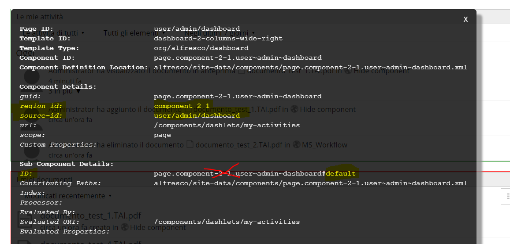

# ALFRESCO NOTES

## Summary

#### [Where to find what](#where-to-find-what-1)
#### [How hide components in surf page](#hide-components-in-surf-page)
#### [How copy a node](#copy-noderef)
#### [Visualize images in base64](#visualize-images-in-base64)

----------

#### Maven archetype generator:
> mvn archetype:generate -Dfilter=org.alfresco:

*N.B. Hyphens are typically used in artifact IDs not in group IDs*

#### General tips:
- Check out models already deployed: `/alfresco/s/api/classes/<prefix>_<name>`
- If you apply a hot edit to the `share-config-custom.xml` you need to refresh all your webscripts from `/share/page/index`.
- How get the **repositoryId** `curl -s -u admin:alfresco "http://<hostname>:<port>/alfresco/s/cmis" | grep repositoryId `
- CMIS endpoint `/alfresco/service/api/cmis`
- Enable **debug log** for JS-webscript: go to `tomcat/shared/classes/alfresco/extension/custom-log4j.properties` and change
````
    log4j.logger.org.alfresco.repo.jscript=debug
    log4j.logger.org.alfresco.repo.jscript.ScriptLogger=debug
````

### Start/Stop alfresco:
````
    tomcat/bin/startup.sh && tail -f tomcat/logs/catalina.out 
    tomcat/bin/shutdown.sh
````

### Hot deploy:
1. In Alfresco-Share navigate to `Repository>Data dictionary>Models`
2. Set property `model active = TRUE`
3. check `alfresco/service/api/classes/<prefix>_<name>`
4. Will not visible until the `share-config-custom.xml` will not be modified

### Deploy AMPs:
1. ` java -jar /bin/alfresco-mmt.jar list      tomcat\webapps\alfresco `
2. ` java -jar /bin/alfresco-mmt.jar uninstall <moduleName> tomcat\webapps\alfresco `
3. ` java -jar /bin/alfresco-mmt.jar install   amps\mymodule-repo.amp tomcat\webapps\alfresco -force -nobackup -verbose `
4. ` java -jar /bin/alfresco-mmt.jar install   amps_share\mymodule-share.amp tomcat\webapps\share -force -nobackup -verbose `

### Bash command/tips:
- List of JAVA running process: `ps -ef | grep java ` 
- List of stopped process: `jobs `
- Bring foreground process towards: `fg ` 
- `netstat -an | grep alfresco | grep java | grep 8080 `
- `less ` -> *to search* type: `/wordtosearch` -> *next match* press: `n`
- List  of commands you are allowed to do: `sudo su -l `
- `sudo su - <user>`
- `sudo -i `
- `host <ip>` show ip
- `grep -rI --exclude-dir=test --exclude-dir=target "<wordtosearch>" . `
- `find . -name "<wordtosearch>" `
- `find . -name service.xml -exec du -h  \{\} \; | sort -k1 -h` trova file mostra il size e ordina; -k1 sta per prima colonna
- `chown <owner>:<group> <file>`
- `du -sh <directory>`

### Where to find what
- **out-of-the-box model** in `alfresco/WEB-INF/lib/alfresco-repository-5.2.3.jar/alfresco/model` 
- **out-of-the-box form control** in `share/WEB-INF/classes/alfresco/site-webscripts/org/alfresco/components/form/controls` 

## Usefull snippets

### Hide components in surf page
[Alfresco official doc reference](https://docs.alfresco.com/5.2/tasks/dev-extensions-share-tutorials-hide-content.html)

Summary:
 - Enable **surfbug**: `/share/page/surfBugStatus`
 - Take notes about *region-id*, *source-id* and sub-component's *id* (the ID is the one after the hash)
 - Put the xml definition under: `amp-share/src/main/amp/config/alfresco/web-extension/site-data/extensions`
 
 


----------

### Copy noderef
[Alfresco official doc reference](https://docs.alfresco.com/5.2/references/dev-services-copy.html)

----------

###  Header to set in order to show or dowload a document in a respose object for Webscripts. 
[IETF DOC](https://www.ietf.org/rfc/rfc2183.txt):
``` java
    res.addHeader("Content-Disposition", "inline; filename=" + fileName);
    res.addHeader("Content-Disposition", "attachment; filename=" + fileName);
```

----------

### Visualize images in base64:
``` html
    
```

``` java
    InputStream inputStream = contentService.getReader(nodeRef , ContentModel.PROP_CONTENT).getContentInputStream();
    byte[] arrBuff = IOUtils.toByteArray(inputStream);
    inputStream.close();
    return Base64.encodeBase64URLSafeString(arrBuff);
```

----------

### Check if node ref is valid and has right type:
``` java
    QName nodeType = nodeService.getType(nodeRef);
    FileFolderServiceType fileFolderNodeType = fileFolderService.getType(nodeType);

    if (fileFolderService.exists(nodeRef) || !fileFolderNodeType.equals(FileFolderServiceType.FOLDER) ) {
        throw new MyException(
                HttpServletResponse.SC_BAD_REQUEST,
                "Destination folder must be of type "+ContentModel.TYPE_FOLDER);
    }
```
